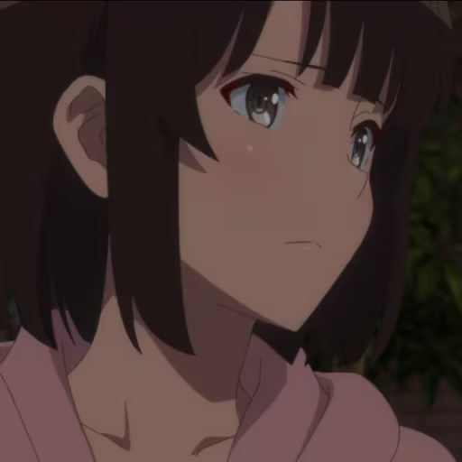

# Girl Agent    
Disclaimer: Learned and carried open source code from the internet! Not original code!           
--------------
This repo provide a girlfriend agent that can chat with us, also my first trial in LLM.
In my opinion that's so interesting! Maybe I would focus on NLP rather than reliability, haha    
Though the repo is named as "Girl" Agent, but it's not only for girls. You can easily make it your own agent. The name is just because of the interests of me to have some E-girlfriends.     

Some anime girls here:    
<table>
  <tr>
    <td align="center">
      <br>
      <p><b>Kato Megumi</b></p>
    </td>
    <td align="center">
      <br>
      <p><b>Nakano Miku</b></p>
    </td>    
    <td align="center">
      <br>
      <p><b>Kitagawa Marin</b></p>
    </td>
  </tr>
</table>    

## How to use 
**1. Clone the repo**
**2. Use your **own** api-key in [src/config/settings.py](src/config/settings.py),  and change the model you use:**
```
DEEPSEEK_SETTINGS = {
        "api_key":"your-own-api-key",
        "api_base":"https://api.deepseek.com",
        "model":"deepseek-chat",
}
```
**and choose your preferred personality and characters**
```
AGENT_SETTINGS = {
        "name":"Lamia",
        "age":19,
        "gender":"女",
        "occupation":"学生",
        "personality":"Lamia"
}
```
`"personality"`**names in [src/prompts/personalities](src/prompts/personalities). You can also to create your favorite character~**  

**3. Run main.py**
```
python src/main.py
```